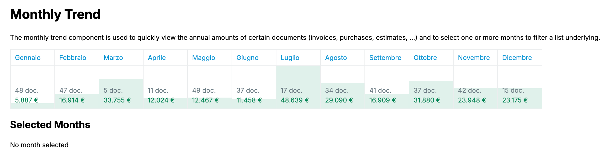

# Monthly Trend



Semplice componente React per visualizzare un grafico a barre mensili.

## Demo

Si può provare il componente funzionante all’indirizzo:

[https://monthly-trend.vercel.app/](https://monthly-trend.vercel.app/)

## Struttura del progetto

  Dopo l’installazione, troverai la struttura del progetto organizzata come segue:

    monthly-trend/
    ├── index.html
    ├── src/
    │   ├── components               # Cartella di componenti
    │   │   ├── MonthlyTrend         # Cartella del componente MonthlyTrend 
    │   │   │   ├── constants.ts     # Costanti per personalizzazioni
    │   │   │   ├── MonthlyBar.tsx   # Sottocomponente che identifica il mese
    │   │   │   ├── MonthlyTrend.tsx # Componente princiale
    │   │   │   ├── utils.ts         # Utility varie
    │   ├── App.tsx                  # Componente principale
    │   ├── main.tsx                 # Punto d'ingresso principale per React
    │   └── vite-env.d.ts            # Definizioni TypeScript specifiche per Vite
    ├── package.json
    └── tsconfig.json                # Configurazione TypeScript

## Installazione

- Clonare il progetto

    ```jsx
    git clone https://github.com/dynamick/monthly-trend.git
    ```

- **Accedi alla cartella del progetto**

  Dopo la creazione, entra nella directory del progetto:

    ```bash
    cd monthly-trend
    ```

- **Installa le dipendenze**

  Installa tutte le dipendenze necessarie usando:

    ```bash
    npm install
    ```

- **Avvia il progetto in modalità sviluppo**

  Una volta installate le dipendenze, puoi avviare il progetto con:

    ```bash
    npm run dev
    ```

  Vite farà partire un server locale, di solito accessibile su `http://localhost:5173`, e visualizzerà l'URL nel terminale.

## Librerie utilizzate

- [React](https://reactjs.org/)
- [Vite](https://vitejs.dev/)
- [TypeScript](https://www.typescriptlang.org/)
- [Styled Components](https://styled-components.com/)
- [Date-fns](https://date-fns.org/)


Happy reviewing 🚀
